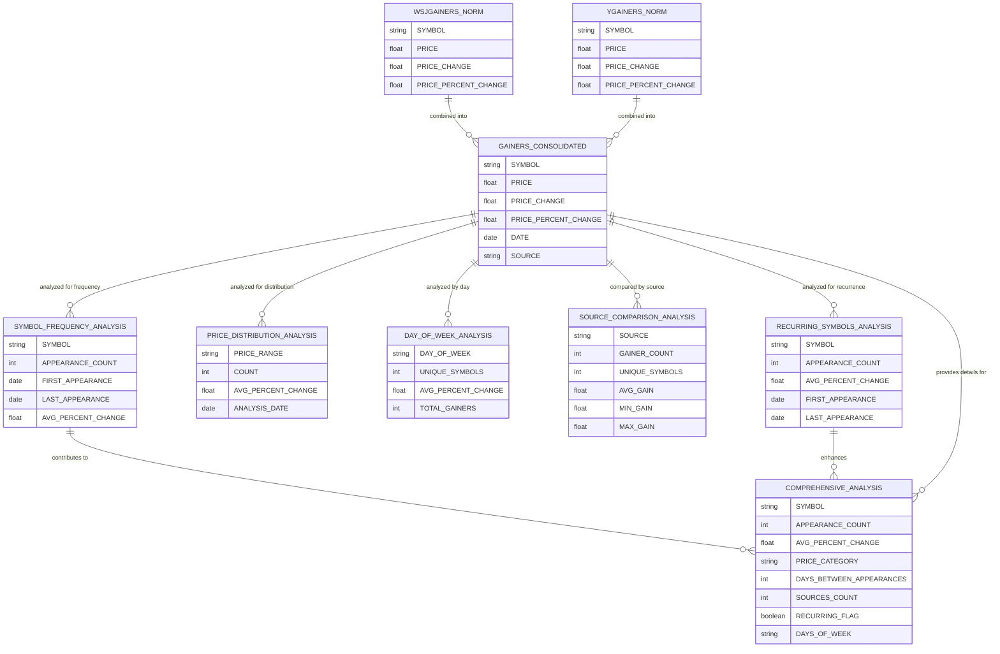

# Lab-08 Database Outline of Report

## Introduction
This Outline Report represents a data model for analyzing daily stock gainer lists from Wall Street Journal and Yahoo Finance. The purpose is to transform raw financial data into meaningful insights for non-financial stakeholders through a series of intermediate and final tables. By structuring the data this way, we aim to help stakeholders understand patterns in gainer lists, identify recurring investment opportunities, and develop informed trading strategies.

## ERD Diagram Code Created in mermaidjs.live

## ERD Design Explanation:

Intermediate tables, thinking big then small as described in assignment instructions and in class lecture. We want to think of overall concept and not to get too granular in this stage. 

### Use Cases

#### Use Case 1: Identifying Recurring Investment Opportunities
One of the primary questions is whether certain symbols repeatedly appear on gainer lists, potentially indicating stocks with consistent momentum. To answer this:

- The `SYMBOL_FREQUENCY` intermediate table tracks appearance counts, first and last appearance dates, and average metrics
- The `RECURRING_SYMBOLS_ANALYSIS` final table provides deeper insights by calculating time between appearances, price change patterns, and categorizing symbols by performance
- This enables stakeholders to quickly identify stocks that frequently appear as gainers and understand their performance patterns

Example query: "Which stocks have appeared on gainer lists at least three times in March 2025, and their average percentage gain?"

#### Use Case 2: Price Range Investment Strategy
Non-financial stakeholders need to understand how different price ranges perform to optimize portfolio allocation:

- The `PRICE_DISTRIBUTION` intermediate table segments stocks by price ranges and calculates performance metrics for each range
- The `PRICE_RANGE_ANALYSIS` final table enhances this by identifying which price ranges have the most recurring symbols and highest performance
- This helps stakeholders target specific price ranges that historically show the best combination of performance and consistency

Example query: "Are stocks in the $10-$25 range more likely to appear repeatedly on gainer lists compared to stocks over $100?" This question specifically can help give stakeholders VERY useful insight especially in quarter trending, is a way we approach in my day job. 

#### Use Case 3: Volume-Based Trading Signals
For stocks with volume data (primarily from Yahoo Finance):

- The `VOLUME_DISTRIBUTION` intermediate table groups stocks by trading volume to identify patterns
- The `VOLUME_PATTERN_ANALYSIS` final table correlates volume with price movement to identify potential momentum indicators
- This allows stakeholders to incorporate trading volume into their decision-making process

Example query: "Do high-volume gainers (>200% of 3-month average volume) show better consistent performance than low-volume gainers?"

#### Use Case 4: Day-of-Week Trading Strategies
Many non-financial stakeholders want to know if certain days show better opportunities:

- The `DAY_OF_WEEK_STATS` intermediate table aggregates performance by day of the week
- The `TRADING_PATTERN_ANALYSIS` final table develops specific trading strategies based on historical day patterns
- This enables stakeholders to optimize the timing of their trading activities

Example case: What historically is a day that hits high yield? 

### Methods

The data processing pipeline: 

1. **Data Collection and Integration**: Raw data from Wall Street Journal and Yahoo Finance is collected in the `RAW_DAILY_GAINERS` table, preserving all original fields.

2. **Data Standardization**: The `CONSOLIDATED_GAINERS` table normalizes this data, adding derived fields like day_of_week and splitting timestamp into date and time components.

3. **Dimensional Analysis**: Four intermediate tables focus on specific dimensions of analysis:
   - Symbol frequency (recurring stocks)
   - Price distribution (price range analysis)
   - Volume distribution (trading activity patterns)
   - Day-of-week statistics (temporal patterns)

4. **Insight Generation**: The final analysis tables transform these dimensions into actionable insights:
   - Recurring symbol performance analysis
   - Price range investment recommendations
   - Volume-based trading signals
   - Day-specific trading strategies

Each table is designed to iteratively refine the data, like a traditional funnel concept in the GOV sector, where I work. 

## Summary

This ERD provides a comprehensive framework for analyzing stock gainer lists, addressing the key questions about composition, distribution, and patterns. The design enables both broad overview analysis and detailed drill-down (funnel style) into specific dimensions.
While the current model focuses on the data directly available from WSJ and Yahoo Finance, future enhancements could incorporate:
- Sector( like GOV and healthcare spend potentially) and industry classification for industry-specific analysis
- Broader market index data for relative performance comparison
- News sentiment data to correlate with gainer appearances
The data model effectively bridges the gap between complex financial data and actionable insights for non-financial stakeholders. However, there is a potential to tailor to specific sector work if needed. Overall, this ERD does give useful insight for our goal of understanding what is in the gainers and how to apply them to varying use cases. 
